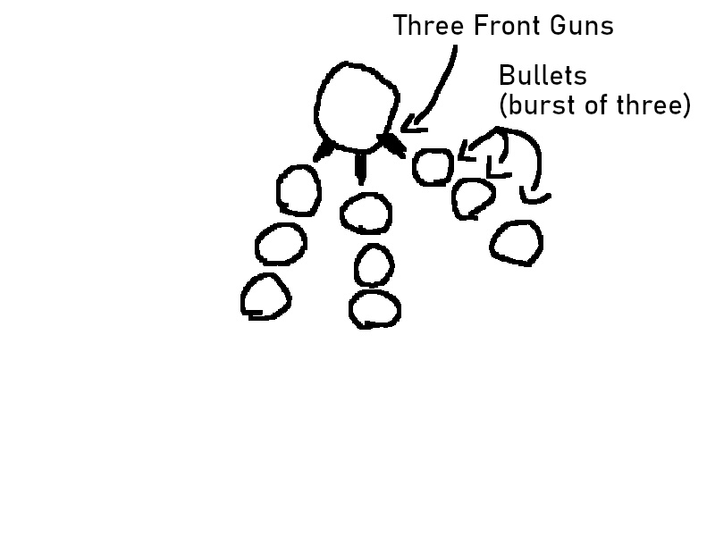
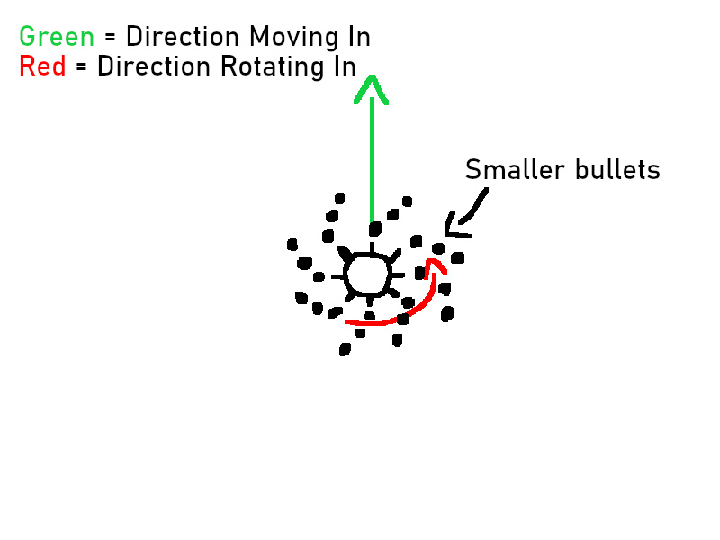
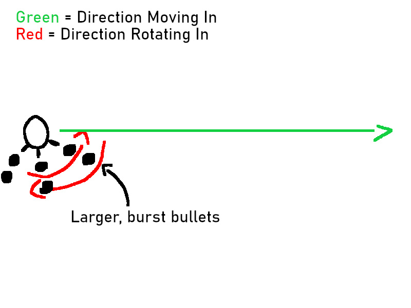

## Boss Battle Design - Octogun
Octogun is a dangerous ship with 8 guns. It can spin and fire _at the same time_. Octogun is not to be trifled with.

### Visual Key
For visuals, codeblocks are used. The key for the symbols used is as such:
  * `.` is empty space.
  * `*` is a patrol point OR a point that Octogun is moving towards
  * `@` is the player's side of the stage.
  * `O` is Octogun.
  * `#` is a barrier.
  * `->` or `<-` or any other set of direction arrows indicate which direction Octogun is moving.

### Movement Patterns
When Octogun is described as rotating, they always rotate _counterclockwise_.

#### Patrol Points - Default State
Octogun's default state is to patrol between a triangular set of points (two in the back, one closer to center).
```
.....*O->.................................*.....
................................................
................................................
................................................
.......................*........................
................................................
................................................
................................................
................................................
................................................
................................................
................................................
.......................@........................
................................................
```

#### Up Close and Personal - RotationFire State
State Transition Guide: `Default State -> MovingToPoint State -> RotationFire State -> Default State`

Randomly, Octogun will move close to center stage and once they reach there, begin to rotate while moving back. Once they reach the very back of the stage, they will return to the Default State (and thus resume patrol).
```
.......................*........................
................................................
................................................
................................................
.......................^........................
.......................|........................
.......................O........................
................................................
................................................
................................................
................................................
................................................
.......................@........................
................................................
```

#### Aggressive Strafe - StrafeFire State
State Transition Guide: `Default State -> MovingToPoint State -> StrafeFire State -> Default State`

Once Octogun's health has been dropped below 50%, they will gain a new random behavior. They will move to the left edge of the stage. Once they reach there, they will begin to rotate slowly counterclockwise (to 90 deg) and back clockwise (to 90 deg) and move to the right edge of the stage. Once they reach the right edge of the stage, they will return to the Default State (and thus resume patrol).
```
................................................
................................................
................................................
................................................
................................................
O->............................................*
................................................
................................................
................................................
................................................
................................................
................................................
.......................@........................
................................................
```

### Attack Patterns
#### Trigun Bursts - Default State
While patrolling, Octogun will fire between 1-5 bursts of large projectiles out of their three front guns. The number of bursts and their intervals between them will be chosen randomly, the interval between each set of projectiles of the burst _will not_ be random.



#### Rotating Fire - RotationFire State
While in the RotationFire state, Octogun will be quickly rotating and firing from all 8 guns at steady intervals. These bullets are smaller than the ones fired during the Default State.



#### Strafe Fire - StrafeFire State
While in the StrafeFire state, Octogun will slowly rotate from right to left, firing from their 3 front guns in two-shot bursts. These bullets are smaller than the ones fired duing the Default State but larger than the ones fired during the RotationFire state.



### Innovation
When Octogun is reduced to 50% HP, they will release barriers that block the player's shots but not their own. The barriers can be destroyed with enough damage from the player.
```
................................................
................................................
................................................
................................................
................................................
................................................
................................................
.#####................####................#####.
................................................
................................................
................................................
................................................
.......................@........................
................................................
```
